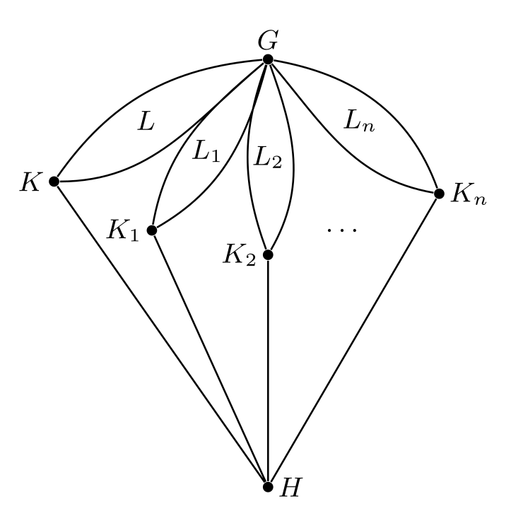
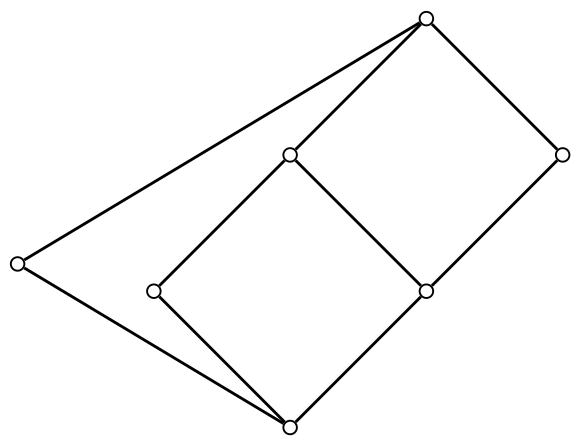

# Revisiting Enforceable Properties for the Finite Lattice Representation Problem: A Tame Congruence Theory Perspective

This page was compiled with the help of the Gemini 2.5 Pro AI assistant in "Deep
Research" mode.

## 1. The Finite Lattice Representation Problem: Context and Framework

This section establishes the foundational context of the Finite Lattice 
Representation Problem (FLRP) and meticulously dissects DeMeo's contributions
[[1](#works-cited)], highlighting the mechanisms relevant to the proposed combined
strategy.

### 1.1. Brief Recapitulation of the FLRP and the Pálfy-Pudlák Theorem

The Finite Lattice Representation Problem (FLRP) stands as a central open question in
universal algebra, asking for a characterization of those finite lattices that are
isomorphic to the congruence lattices of finite algebras.[[1](#works-cited)] 
The study of congruence lattices, which encode the homomorphic images and internal
symmetries of algebraic structures, is fundamental to understanding the structure of
algebras themselves.

A pivotal result connecting this problem to group theory is the Pálfy-Pudlák
Theorem.[[17](#works-cited)] This theorem states two equivalent conditions:

+  (A) Every finite lattice is isomorphic to the congruence lattice of some finite
   algebra $A$ (denoted $\mathrm{Con}(A)$).
+  (B) Every finite lattice is isomorphic to an interval in the subgroup lattice of
   some finite group $G$ (denoted $[H, G]$, representing the lattice of subgroups of $G$
   containing $H$ and contained in $G$).

The equivalence (A) ⟺ (B) implies that if one can find a finite lattice $L$ for which
it can be proven that no finite group $G$ exists such that $L ≅ [H, G]$ for some subgroup
$H$ of $G$, then it would follow that statement (A) is false, and the FLRP would have a
negative answer. This theorem, therefore, transforms a problem in universal algebra
and lattice theory into a problem concerning the structure of subgroup lattices of
finite groups, providing the primary motivation for the approach detailed in
DeMeo.[[1](#works-cited)] The strategic importance of this connection cannot be
overstated, as it opens a pathway to addressing the FLRP through group-theoretic
constructions and arguments.

### 1.2. Core-Free Interval Enforceable (cf-IE) Properties: Definitions and Significance
  
In  [[1](#works-cited)], building upon the Pálfy-Pudlák theorem [[17](#works-cited)],
DeMeo introduces a classification of group-theoretic properties based on their
relationship to lattice intervals. An "interval enforceable (IE)" property $P$ is a
group property for which there exists a finite lattice $L$ such that if $G$ is a
group with $L$ isomorphic to an interval $[H, G]$ in its subgroup lattice
$\mathrm{Sub}(G)$, then $G$ must possess property $P$.

A more refined and crucial concept for the FLRP is that of 
*core-free interval enforceable* (cf-IE) properties.
A property $P$ is cf-IE if there exists a finite lattice $L$ such that if $G$ is a
group with $L ≅ [H, G]$ and $H$ is a core-free subgroup of $G$ (i.e.,
$\mathrm{core}_G(H) = 1$, meaning $H$ contains no non-trivial normal subgroup of
$G$), then $G$ must possess property $P$.[[1](#works-cited)]

The core-free condition, $\mathrm{core}_G(H) = 1$, is of paramount significance. 
When $H$ is core-free in $G$, the group $G$ admits a faithful permutation
representation $ϕ$ on the set of right cosets $G/H$. It is a well-established result
that the congruence lattice of the algebra $⟨G/H, ϕ(G)⟩$ (formed by the $G$-set $G/H$
with the action of $G$) is isomorphic to the interval $[H, G]$ in $\mathrm{Sub}(G)$. 

This isomorphism is the critical link: it means that a core-free interval $[H, G]$
*is* the congruence lattice of a specific finite algebra derived directly from the
group $G$ and subgroup $H$. Consequently, cf-IE properties are group properties that are
forced upon $G$ when a particular lattice $L$ appears as the congruence lattice of such a
$G$-set. This directly connects the study of subgroup intervals under the core-free
condition to statement (A) of the Pálfy-Pudlák theorem, making cf-IE properties
particularly potent tools for investigating the FLRP. Without the core-free
assumption, the interval $[H, G]$ might not directly correspond to a congruence lattice
of an algebra naturally derived from $G$ in a way that is immediately relevant to the
FLRP as formulated by Pálfy and Pudlák in [[17](#works-cited)].

DeMeo [[1](#works-cited)] provides several examples of cf-IE properties. Insolubility
is shown to be IE (and therefore cf-IE), while solubility is demonstrated to be not
even cf-IE.  Other identified cf-IE classes of groups include those that
are not alternating or symmetric groups, subdirectly irreducible groups, groups
possessing no non-trivial abelian normal subgroups, and groups $G$ for which the
centralizer $C_G(M)$ is trivial for every non-trivial normal subgroup $M$ of
$G$. These examples underscore that cf-IE properties can be substantial and
non-trivial, offering a way to impose strong structural constraints on groups based
on the lattice-theoretic structure of their subgroup intervals.

### 1.3. Strategic Importance of Thm 3.6 and the Parachute Construction for FLRP

A cornerstone of DeMeo's proposed strategy for the FLRP is Theorem 3.6 of
[[1](#works-cited)]. This theorem establishes further equivalences to statement (B)
of the Pálfy-Pudlák theorem (and thus to a positive answer to the FLRP). Among these,
statement (C) is particularly relevant:

+  (C) For every finite lattice $L$, for every finite collection $X_1$, ..., $X_n$ of
   cf-IE classes of groups, there exists a finite group $G ∈ ⋂ \{X_i : 1 ≤ i ≤ n\}$
   such that $L ≅ [H, G]$ for some subgroup $H$ that is core-free in $G$.

The strategic implication of Theorem 3.6 (C) is profound: if one could identify a
finite collection of cf-IE classes of groups, $X_1$, ..., $X_n$, whose intersection is
empty (i.e., no finite group can simultaneously possess all these properties), then
statement (C) would be false for any choice of $L$. This, in turn, would imply that
statement (B) of the Pálfy-Pudlák theorem is false, leading to a negative resolution
of the FLRP. This transforms the FLRP into a concrete group-theoretic problem: the
search for a set of mutually incompatible cf-IE properties.

The "parachute lattice" construction (Figure 4 of
[[1](#works-cited)] and reproduced below), denoted $P(L, L_1, ..., L_n)$, is a key
technical device used in proving the equivalence (B) ⟹ (C). This construction
involves creating a new lattice P from a given lattice $L$ and a set of lattices
$L_1$, ..., $L_n$ (where each $L_i$ is known to enforce a cf-IE property $P_i$). If
statement (B) holds, then $P$ must be representable as a core-free interval $[H, G]$
for some group $G$.  The structure of the parachute lattice then ensures that the
sub-intervals within $[H, G]$ corresponding to $L_i$ are also core-free intervals
isomorphic to $L_i$. Consequently, $G$ must possess each property $P_i$, placing $G$
in the intersection $⋂ P_i$. The parachute lattice, therefore, serves as a conceptual
blueprint for how multiple cf-IE constraints could be simultaneously imposed on a
single group $G$, should the FLRP have a positive answer. The failure to find such a
group $G$, under increasingly restrictive (yet valid) cf-IE conditions, would provide
evidence against the FLRP.

{width=300 height=200}

Furthermore, Corollary 3.9 of [[1](#works-cited)], which follows from the parachute
construction logic, states that the conjunction of any finite number of cf-IE
properties is itself a cf-IE property. This reinforces the strategy of accumulating
multiple cf-IE properties with the aim of reaching a contradiction (an empty
intersection).

### 1.4. Illustrative Example: Insights from the Analysis of $L_7$

DeMeo's paper provides a compelling illustration of this strategy through a detailed
analysis of a specific seven-element lattice, denoted $L_7$. (Figure 4 of
[[1](#works-cited)] and reproduced below.) This lattice is notable as it is the
smallest for which a congruence lattice representation ($L_7 ≅ \mathrm{Con}(A)$ for
some finite algebra A) is not yet known.[[18](#works-cited), [19](#works-cited)]

{width=300 height=200}

Proposition 4.1 of [[1](#works-cited)] outlines a set of strong group-theoretic
properties that any finite group $G$ must possess if $L_7$ is isomorphic to a core-free
interval $[H, G]$ in $\mathrm{Sub}(G)$:

1.  $G$ must be a primitive permutation group (derived from the core-freeness of a
    maximal subgroup $K$ corresponding to an element in $L_7$).

2.  For any non-trivial normal subgroup $N$ of $G$, its centralizer $C_G(N)$ must be
    trivial.

3.  $G$ can contain no non-trivial abelian normal subgroups (a direct consequence of
    the trivial centralizer property).

4.  $G$ must be insoluble (also a consequence of the trivial centralizer property for minimal normal subgroups).

5.  $G$ must be subdirectly irreducible (possessing a unique minimal normal subgroup).

6.  With the possible exception of at most one maximal subgroup in the interval 
    $[H, G]$, all proper subgroups within this interval must be core-free in $G$.

This analysis of $L_7$ serves as a powerful proof-of-concept for DeMeo's general
strategy. It demonstrates that even a relatively small and specific lattice structure
can impose a formidable list of cf-IE properties on any group $G$ that might represent
it as a core-free interval. These derived properties significantly narrow the class
of potential candidate groups $G$. The internal structure of the lattice $L_7$
itself---its specific configuration of meets, joins, and elements like the
non-modular element $K$---is what drives the deduction of these
group properties, often in conjunction with group-theoretic tools like Dedekind's
rule and Lemma 3.5 (concerning permuting subgroups).[[1](#works-cited)] This
highlights that a deep understanding of how lattice-theoretic features translate into
cf-IE properties is essential. The techniques employed in the $L_7$ analysis may
prove adaptable when considering new enforceable properties derived from Tame
Congruence Theory.

## 2. Tame Congruence Theory: A Structural Lens for Finite Algebras

Tame Congruence Theory (TCT), primarily developed by David Hobby and Ralph McKenzie
[[2](#works-cited)], offers a sophisticated framework for analyzing the structure of
finite algebras by examining the local behavior of their congruence lattices. This
theory provides the conceptual tools for potentially defining new and powerful
enforceable properties relevant to the FLRP.

### 2.1. Fundamental Concepts.

The fundamental concepts of TCT are the following:

+ minimal algebras;
+ the five TCT types;
+ (α, β)-minimal sets (traces, body, tail);
+ labeled congruence lattices.

At the heart of TCT is the analysis of prime quotients α ≺ β (meaning α is covered by
β) in the congruence lattice $\mathrm{Con}(A)$ of a finite algebra $A$.  The local
behavior of the algebra in the "vicinity" of such a quotient is captured by
*(α, β)-minimal sets*. 

An **(α, β)-minimal set** $U$ is the range of an idempotent unary polynomial $e$ of
$A$, minimal with respect to the property that the restrictions $α∣_U$ and $β∣_U$ are
different.[[3](#works-cited)]

Within an (α, β)-minimal set $U$, certain $β∣_U$-classes, known as **traces**, are
particularly important; these are the $β∣_U$-classes that are not contained in a single
$α∣_U$​-class. The union of all traces in $U$ forms the **body** $B$ of $U$. The remaining
part, $T = U - B$, is called the **tail**.[[3](#works-cited)]  TCT provides a rich
structural understanding of the body, while the tail is considered less structured or
"wild" from the theory's perspective.[[3](#works-cited)]

A key discovery of TCT is that the algebra $A∣_N$ (the operations of $A$ restricted
to $N$, where $N$ is a trace), when factored by the restricted congruence $α∣_N$, is
polynomially equivalent to one of precisely five types of *minimal algebras*.[[2](#works-cited)]

A **minimal algebra** $M$ is a finite algebra with at least two elements in which every
non-constant unary polynomial is a permutation of its domain.[[5](#works-cited)]

The five TCT types (of minimal algebras) are the following:

1. *Type 1 (Unary)*: pol-equiv to a $G$-set.
2. *Type 2 (Affine)*: pol-equiv to a vector space over a finite field.
3. *Type 3 (Boolean)*: pol-equiv to the two-element Boolean algebra.
4. *Type 4 (Lattice)*: pol-equiv to the two-element lattice.
5. *Type 5 (Semilattice)*: pol-equiv to the two-element semilattice.

This classification allows each prime quotient α ≺ β in $\mathrm{Con}(A)$ to be
assigned one of these five types, transforming $\mathrm{Con}(A)$ into a 
*labeled congruence lattice*.[[2](#works-cited)] This labeling provides a "local
flavor" for the algebra at each prime quotient.

The connection to DeMeo's framework arises when considering the algebra 
$A_G = ⟨G/H, ϕ(G)⟩$, whose congruence lattice is isomorphic to the interval $[H, G]$ when $H$ is
core-free.[[1](#works-cited)] Thus, a TCT analysis of a lattice $L$, when $L ≅ [H, G]$, is
effectively a TCT analysis of $\mathrm{Con}(A_G)$. The TCT types observed in $L$ 
(as $\mathrm{Con}(A_G)$) become fundamental characteristics. The challenge and
opportunity lie in translating these type-dependent properties of $A_G$ back into
group-theoretic properties of $G$ that can be classified as cf-IE.

**Table 1. Summary of the Five TCT Types of Minimal Algebras**. This table summarizes
the five types of minimal algebras central to TCT, their characterizing algebraic
structures, and the nature of their polynomial clones when induced on a trace $N$ for a prime quotient typ(α, β).

| Type | Name        | Characterizing Algebraic Structure | Nature of Poly Clone on Trace $N$ ($A∣_N/α∣_N$)                                                |
|-----:|:------------|:-----------------------------------|:-----------------------------------------------------------------------------------------------|
| 1    | Unary       | Permutation group on a set         | All operations are essentially unary (permutations or constants), or can be simulated by such. |
| 2    | Affine      | Vector space over a finite field   | All operations are affine transformations (linear combinations \+ translations).               |
| 3    | Boolean     | Two-element Boolean algebra        | All operations are those of a Boolean algebra (e.g., join, meet, complement).                  |
| 4    | Lattice     | Two-element lattice                | All operations are those of a lattice (e.g., join, meet).                                      |
| 5    | Semilattice | Two-element semilattice            | All operations are those of a semilattice (e.g., join or meet).                                |

Table 1 provides a concise reference for the fundamental TCT classification,
highlighting the core algebraic structure and polynomial characteristics associated
with each local type. This is crucial for understanding how TCT might define
enforceable properties for $A_G$, which could then translate to properties of $G$. This
information is synthesized from multiple sources.[[2](#works-cited)]

### 2.2. Connecting Local Structure to Global Properties: TCT Types, Malt'sev Conditions, Congruence Identities, Solvability, and Abelianness

TCT reveals deep connections between the local types present in $\mathrm{Con}(A)$ and global
properties of the algebra $A$ and the variety $V(A)$ it generates. A variety is a class
of algebras closed under homomorphic images, subalgebras, and direct products.
(Alternatively, and equivalently according to Birkhoff's HSP Theorem, a variety is
an *equational class* of algebras.)

**Omitting Types and Malt'sev Conditions**. A particularly powerful aspect of TCT is
the characterization of varieties that omit certain sets of types. Such omissions are
often equivalent to the variety satisfying specific Malt'sev conditions, which are
sets of term identities.[[6](#works-cited)] For locally finite varieties:

+  Omitting **type 1** (unary type) is equivalent to the variety being a 
   **Taylor variety**, i.e., possessing a Taylor term. A Taylor term is an idempotent
   term $t(x_1, ..., x_n)$ such that for each $i ∈ \{1, ..., n\}$, 
  
   \\[t(x, ..., x, y, x, ..., x) = t(x, ..., x, z, x, ..., x)\\]

   holds if $y$ and $z$ are in the $i$-th position and all other variables are $x$.[[6](#works-cited)]

+  Omitting **types {1, 5}** (unary and semilattice types) is equivalent to the
   variety satisfying a **non-trivial congruence identity** and possessing a
   Hobby-McKenzie term.[[6](#works-cited)]
+  Omitting **types {1, 2}** (unary and affine types) is equivalent to the variety
   being **congruence meet-semidistributive** (SD(∧)).[[6](#works-cited)]
+  Omitting **types {1, 2, 5}** (unary, affine, and semilattice types) is equivalent
   to the variety being **congruence join-semidistributive** (SD(∨)).[[6](#works-cited)]
+  A variety is **congruence modular** if and only if its type set is contained in
   {2, 3, 4} and all its minimal sets have empty tails.[[3](#works-cited)]
+  A variety is **congruence distributive** if and only if its type set is contained
   in {3, 4} and all its minimal sets have empty tails.[[10](#works-cited)]

These equivalences provide a pathway: if the structure of a lattice $L$ (as $\mathrm{Con}(A_G)$) forces the omission or presence of certain TCT types in $A_G$, then $A_G$ (or $V(A_G)$) must satisfy corresponding strong algebraic conditions. The primary challenge, then, is to translate these algebraic properties of $A_G$ (e.g., "possesses a Taylor term") into meaningful group-theoretic properties of $G$ that can be shown to be cf-IE.

**Solvability and Abelianness**. Commutator theory for congruences defines notions of
solvable and abelian congruences. A prime quotient α ≺ β is **abelian** if the
commutator [β, β] is less than or equal to α. An interval $I[δ, θ]$ is **solvable** if
it has a finite chain of congruences $δ = γ_0 ≺ γ_1 ≺ ⋯ ≺ γ_k = θ$ such that each factor
$I[γ_i, γ_{i+1}]$ is abelian.[[12](#works-cited)]

+  Prime quotients of **type 2** (affine) are always abelian.[[2](#works-cited)]
+  Prime quotients of **type 1** (unary) can be either abelian or non-abelian.[[2](#works-cited)]
+  If an interval $I[δ, θ]$ is solvable, then all its prime factors must be of type 1
   or type 2 [[2](#works-cited) (Theorem 7.12)].  This connection is significant because if a lattice
   $L$, when represented as $\mathrm{Con}(A_G)$, forces certain intervals to be solvable or certain
   quotients to be abelian (or non-abelian), this imposes strict TCT type constraints
   on $\mathrm{Con}(A_G)$.

### 2.3. The Notion of "Tameness" and the Significance of "Empty Tails" in Minimal Sets

The term "tame" in TCT broadly refers to the well-behaved, structured nature of local
polynomial operations, particularly on the **body** of an (α, β)-minimal set $U$. TCT
provides extensive information about the structure induced on the body $B$. In
contrast, the **tail** $T = U - B$ is often described as "wild," meaning TCT offers
very little structural insight into it.[[3](#works-cited)]

The condition that minimal sets have **empty tails** ($T = ∅$, so $U = B$) is highly
significant. When tails are empty, the local structure is fully "tame," and the
analytical power of TCT can be most effectively applied. The presence of non-empty
tails, especially for types 1 or 5, is intrinsically linked to failures of congruence
modularity. For instance, if a minimal set of type $i ∈ \{2, 3, 4, 5\}$ has a non-empty
tail, it forces the existence of a pentagonal sublattice N5 (a hallmark of
non-modularity) of type $i$ in the congruence lattice of some subalgebra of $A^2$.
Conversely, strong conditions on the labeled congruence lattice, such as the absence
of such pentagons, can force tails to be empty.[[3](#works-cited)]

For a locally finite variety $V$ to be **congruence modular**, two conditions must be
met: its type set must be restricted to {2, 3, 4} (i.e., types 1 and 5 must be
omitted), AND all minimal sets associated with these types must have empty tails.[[3](#works-cited)]
The "empty tails" condition is thus a critical component of "tameness" in the context
of well-behaved varieties like congruence modular ones.

If a lattice $L$, interpreted as $\mathrm{Con}(A_G)$, were to force $A_G$ to have
minimal sets with non-empty tails of type 1 or 5, this would indicate a certain
"wildness" in $A_G$ and imply that $V(A_G)$ is not congruence modular. Such
"wildness," if translatable into a group-theoretic property, could be a candidate for
a cf-IE property. The challenge remains in formalizing "wildness" (e.g., non-empty
tails of specific types) as an algebraic property of $A_G$ that subsequently
translates into a cf-IE group property of $G$.

## 3. Defining Enforceable Properties via Tame Congruence Theory

This section explores concrete ways TCT concepts can be harnessed to define new cf-IE
group properties, focusing on the crucial step of translating properties of $\mathrm{Con}(A_G)$
or the algebra $A_G$ itself into properties of the group $G$.

### 3.1. Leveraging TCT Types: Proposing cf-IE properties based on the presence or omission of specific TCT types or type configurations in $\mathrm{Con}(A_G)$.

A primary avenue for defining new enforceable properties through TCT involves the set
of types present in $\mathrm{Con}(A_G)$ (which is isomorphic to the interval 
$L ≅ [H, G]$ when $H$ is core-free).

+  **Properties Based on Type Omission**. If a lattice $L$, by its structure, forces any
   algebra $A$ for which $\mathrm{Con}(A) ≅ L$ to omit certain TCT types from its type set (or
   from the type set of the variety $V(A)$ it generates), this leads to strong
   algebraic consequences. For instance:
   1.  If $L$ forces $V(A_G)$ to omit **type 1** (unary type), then $A_G$ must
       possess a Taylor term, and $V(A_G)$ is a Taylor variety.[[6](#works-cited)]
   2.  If $L$ forces $V(A_G)$ to omit **types {1,5}** (unary and semilattice types), then
       $A_G$ must satisfy a non-trivial congruence identity and possess a Hobby-McKenzie
       term.[[6](#works-cited)] The critical step is then to determine if "$G$ is a
       group such that $A_G$ has a Taylor term (or satisfies a given congruence
       identity)" can be established as a cf-IE property of $G$, meaning it is
       enforceable by some (potentially different) lattice $L′$. This translation
       from an algebraic property of $A_G$ to a cf-IE group property of $G$
       represents a significant theoretical challenge. 
+  **Properties Based on Type Presence**. Conversely, if the structure of $L$ forces
   $\mathrm{Con}(A_G)$ to exhibit certain TCT types, this can also lead to enforceable
   properties. For example, if $L$ is a non-modular lattice, then $\mathrm{Con}(A_G)$ must be
   non-modular. In locally finite varieties, non-modular congruence lattices
   necessitate the presence of TCT types 1 or 5 [[2](#works-cited) (Corollary 5.20)].
   Thus, if a non-modular lattice $Lₙₘ$ enforces the property "$A_G$ admits type 1 or type 5," then
   "$G$ is a group such that $A_G$ admits type 1 or 5 when $Lₙₘ ≅ [H, G]$" could be a
   candidate cf-IE property.

The "empty tails" condition is an important qualifier. Properties like "$V(A_G)$ omits
type 1 AND has empty tails for all its minimal sets" would be stronger and more
directly related to conditions like congruence modularity.[[2](#works-cited)]

The translation hurdle remains: how does an algebraic property of $A_G$ (like
"$V(A_G)$ is congruence modular") translate to a cf-IE group property of $G$?

### 3.2. Exploiting Geometric Constraints in Labeled Congruence Lattices

The geometric configuration of prime quotients within $\mathrm{Con}(A) ≅ L$ imposes constraints on their TCT type labels.

+  **Perspectivity and Projectivity**. Two prime quotients $I_1​ = I[α, β]$ and 
   $I_2​ = I[γ, δ]$ in $\mathrm{Con}(A)$ are **perspective** if they are opposite
   sides of a diamond (M3) or a pentagon (N5) (in which case, $α = β ∧ γ$ and $δ = β ∨ γ$). 
   **Projectivity** is a sequence of perspectivities. A fundamental result in TCT
   (often detailed in Chapter 6 of Hobby & McKenzie, e.g., Lemmas 6.2--6.6) is that
   if two prime quotients are projective, they must have the same TCT type, provided
   certain conditions hold (e.g., the projectivity avoids type 1 quotients or the
   lattice is modular).[[2](#works-cited)] This "type consistency under projectivity"
   is a powerful constraint.
+  **N5 (Pentagon) Subconfigurations**. If L≅$\mathrm{Con}(A_G)$ contains an N5
   sublattice, then $\mathrm{Con}(A_G)$ is non-modular. This forces $V(A_G)$ to admit
   TCT types 1 or 5\. The prime quotients forming the N5 configuration will be
   labeled accordingly, with at least one of them (often the critical quotient) being
   of type 1 or 5 [[2 (Corollary 5.20)](#works-cited), [15](#works-cited)].
+  **M3 (Diamond) Subconfigurations**. If $L ≅ \mathrm{Con}(A_G)$ contains an M3
   sublattice, then $\mathrm{Con}(A_G)$ is non-distributive. If $V(A_G)$ were
   congruence distributive, it would omit types 1, 2, and 5. Therefore, the presence
   of an M3 implies that $V(A_G)$ is not congruence distributive, and thus must admit
   type 1, 2, or 5.  Furthermore, if $\mathrm{Con}(A_G)$ is modular (which M3 itself
   is), types 1 and 5 are omitted from modular intervals unless specific conditions
   apply (related to solvability).

   A variety is congruence meet-semidistributive (SD(∧)) if and only if M3 is not
   embeddable in $\mathrm{Con}(A)$ for any $A ∈ V$; SD(∧) is equivalent to omitting
   types {1, 2}.[[8](#works-cited)]  Thus, the presence of an M3 implies the variety
   is not SD(∧), meaning it must admit type 1 or type 2.  If the interval containing
   M3 is known to be modular, this would point towards type 2. The three covering
   quotients forming the "sides" of an M3 in a modular lattice are perspective and
   thus must have the same type (from {2, 3, 4}).

These geometric constraints offer a direct mechanism for $L$ to enforce TCT types on
$A_G$. For example, if $L_{\mathrm{target}}$ contains an N5 configuration, then any
group $G$ representing $L_{\mathrm{target}}$ as $\mathrm{Con}(A_G)$ must be such that
$A_G$ admits type 1 or 5\. This admission of "wilder" types becomes an algebraic
property of $A_G$, which then needs to be translated into a cf-IE group property of
$G$. The analysis of $L_7$ in DeMeo's paper implicitly uses such geometric reasoning;
for instance, its non-modularity contributes to the derived properties of $G$.

### 3.3. The Role of Solvable/Abelian Congruence Quotients and their TCT Type Correlates

The notions of solvability and abelianness for congruence quotients are deeply
connected to TCT types.

+  A prime quotient $I[α, β]$ is **abelian** if the commutator [β, β] ≤ α. All type 2
   (affine) quotients are abelian. Type 1 (unary) quotients can be either abelian or
   non-abelian.[[2](#works-cited)]. Types 3, 4, and 5 are non-abelian.

+  An interval $I[δ, θ]$ is **solvable** if it has a composition series where each
   prime factor is abelian. Consequently, if an interval is solvable, all its prime
   factors must be of type 1 or type 2. [[2 (Theorem 7.12)](#works-cited)]

If the structure of a lattice $L$ (when $L ≅ \mathrm{Con}(A_G)$) forces certain intervals in
$\mathrm{Con}(A_G)$ to be solvable, or certain prime quotients to be abelian (or non-abelian),
then this imposes strict constraints on the TCT types present.  For instance, if $L$ forces
a prime quotient in $\mathrm{Con}(A_G)$ to be non-abelian, then that quotient cannot
be of type 2 and, if type 1, must be a non-abelian type 1\. DeMeo's result that
insolubility of $G$ is IE [[1](#works-cited)] is an example of how such properties
might connect; if $A_G$ having only solvable congruence quotients implied $G$ is
solvable, then a lattice $L$ forcing a non-solvable quotient in $\mathrm{Con}(A_G)$
might enforce $G$'s insolubility. This link between the TCT commutator and
group-theoretic solvability/nilpotency is a promising area for defining cf-IE
properties.

## 4. Assessing the Combined Strategy: Synergies, Potential, and Challenges

This section critically evaluates the feasibility and potential impact of the
combined DeMeo-TCT approach to the FLRP.

### 4.1. Potential for Progress: The Path to Contradiction

The central strategy, as illuminated by DeMeo's Theorem 3.6 [[1](#works-cited)], is
to identify a collection of cf-IE group properties whose intersection is empty. If such a
collection $\{P_j\}$ exists, then the FLRP would have a negative answer. Tame Congruence
Theory offers a powerful new toolkit to define candidate cf-IE properties.

The synergy unfolds as follows:

1.  DeMeo's framework provides the overarching group-theoretic strategy and the
    parachute lattice construction as a conceptual tool for demonstrating how
    multiple cf-IE properties might be simultaneously forced upon a group $G$ if FLRP
    has a positive answer.

2.  TCT provides a rich vocabulary of algebraic properties ($P_{\mathrm{alg}}$)
    associated with the structure of $\mathrm{Con}(A_G)$ (which is isomorphic to the
    lattice interval $L ≅ [H, G]$). 
    These properties are based on TCT types, type configurations, solvability,
    abelianness, and tail conditions.

3.  The research objective is to translate these TCT-derived algebraic properties of
    $A_G$ into group-theoretic properties ($P_{grp}$​) of $G$, and then to prove that
    these $P_{\mathrm{grp}}$​ are indeed cf-IE, i.e., enforceable by some lattice.

If a set of such TCT-derived cf-IE group properties, possibly combined with known
cf-IE properties (like those from DeMeo's $L_7$ analysis [[1](#works-cited)]), can be shown to be mutually
incompatible (i.e., their intersection is empty), then Theorem 3.6 (C) would lead to
a contradiction, implying FLRP has a negative answer. For example, one might find a
TCT-derived property P1​ (enforced by lattice L1′​) implying $G$ has a highly non-abelian
structure, and another P2​ (enforced by L2′​) implying $G$ has strong commutativity
properties. If P1​ and P2​ are incompatible, then the parachute lattice P(Lany​,L1′​,L2′​)
would be unrepresentable by any group as a core-free interval, falsifying statement
(B) of Pálfy-Pudlák.

A subtle but critical distinction must be maintained: a "forcing lattice" versus an
"enforcing lattice." A specific lattice Ltarget (e.g., $L_7$ or a parachute lattice)
might, by its structure, *force* $A_G$ (where Ltarget ≅ $\mathrm{Con}(A_G)$) to exhibit certain TCT
characteristics, which in turn imply a group property $P_{\mathrm{grp}}$​ for $G$.  However, for $P_{\mathrm{grp}}$​
to be a cf-IE property in DeMeo's sense, there must exist some lattice $L\_{\mathrm{enforce}}$
(which could be different from Ltarget​) such that *any* group X representing $L\_{\mathrm{enforce}}$
as a core-free interval [K, X] must possess property $P_{\mathrm{grp}}$​. This two-layered lattice
argumentation is essential for the logical integrity of applying Theorem 3.6. The
TCT-derived cf-IE properties are somewhat self-referential in this regard: the
"enforcing lattice" $L_{P_i}$ for a TCT-derived property $P_i$ would itself need to be a
lattice whose structure inherently forces specific TCT features on any algebra whose
congruence lattice it is.

DeMeo's analysis of $L_7$ [[1](#works-cited)] already provides a set of potent cf-IE properties (G is
primitive, insoluble, $C_G(N) = 1$, etc.). If TCT analysis of $L_7$ (or other lattices) can
yield *new, independent* cf-IE properties of G, the intersection of required
properties shrinks, making a contradiction more attainable.  For instance, $L_7$ is
non-modular, implying $\mathrm{Con}(A_G)$ must admit types 1 or 5; if this admission can be
translated into a new cf-IE group property not already covered by DeMeo's analysis,
progress is made.

**Table 2. Known and Candidate TCT-Derived cf-IE Properties**.
This table outlines existing cf-IE properties and proposes candidate properties
derivable from TCT, highlighting the crucial link to group $G$ and the nature of the
enforcing lattice.

| Property Type | Property Description (for Group $G$ or Algebra $A_G$≅G/H) | Known/ Candidate | Enforcing Lattice/Condition (Hypothesized for Candidates) | Notes / Connection of $A_G$ property to $G$ |
| :---- | :---- | :---- | :---- | :---- |
| DeMeo (Known) | $G$ is insoluble | Known | Pálfy's lattice LS​ (not representable by soluble groups) 1 | Direct group property. |
| DeMeo (Known) | $G$ is not An​ or Sn​ (for any n) | Known | Lattices from Basile, Aschbacher & Shareshian 1 | Direct group property. |
| DeMeo (Known, via $L_7$) | $G$ is subdirectly irreducible | Known if $L_7 ≅ [H, G]$ | $L_7$ 1 | Property of $G$ if $L_7$ is the interval. |
| DeMeo (Known, via $L_7$) | For any $1 = N ◃ G$, $C_G(N) = 1$ | Known if $L_7 ≅ [H, G]$ | $L_7$ 1 | Property of $G$ if $L_7$ is the interval. |
| TCT-derived (Cand.) | $V(A_G)$ omits TCT type 1 (is a Taylor variety) | Candidate | A lattice $L_{no−1}$ whose structure forces any $\mathrm{Con}(A) ≅ L_{no−1}$ to omit type 1\. | *Challenge*: Translate "V(G/H) has Taylor term" to a structural property of $G$. May relate to $G$ having no "unary-like" actions or specific chief factor properties. |
| TCT-derived (Cand.) | $V(A_G)$ omits TCT types {1,5} (satisfies a non-trivial congruence identity) | Candidate | A lattice Lno−1,5​ whose structure forces omission of types {1,5}. | *Challenge*: Translate "V(G/H) satisfies cong. identity X" to a property of $G$. |
| TCT-derived (Cand.) | $\mathrm{Con}(A_G)$ contains an N5 sublattice (hence types 1 or 5 must be present in $V(A_G)$) | Candidate | Any non-modular lattice LNM​. | If LNM​≅[H, G], then V(G/H) has types 1 or 5\. Could force $G$ to be non-CM (if tails are non-empty) or relate to specific simple sections of $G$. |
| TCT-derived (Cand.) | $\mathrm{Con}(A_G)$ is modular (hence $V(A_G)$ omits types 1,5 and has empty tails for types {2,3,4}) | Candidate | A modular, non-distributive lattice LM​. | If LM​≅[H, G], V(G/H) is congruence modular. Strong constraint. May imply $G$ is solvable or has specific chief factor structures (e.g., only affine or simple non-abelian of specific TCT types). |
| TCT-derived (Cand.) | An interval I\[α,β\] in $\mathrm{Con}(A_G)$ is solvable (all prime factors type 1 or 2\) | Candidate | A lattice L whose structure forces a specific interval to be solvable in any Con(A)≅L. | Forces local structure of Con(G/H) to be types 1 or 2\. $A_G$ has locally abelian/affine structure. Impact on G's derived series or commutator structure? |

### 4.2. Methodological Strengths

The proposed combination of DeMeo's enforceability framework with TCT offers
significant methodological advantages. TCT provides a systematic and deeply
structural way to analyze $\mathrm{Con}(A_G)$ (which is isomorphic to the given lattice interval
L). This goes beyond classical lattice theory, offering a classification of local
algebraic behaviors (the five types) and rules for how these types are distributed
within the congruence lattice (e.g., type preservation under projectivity,
constraints imposed by M3 or N5 subconfigurations) [[[2](#works-cited)] (Lemmas 5.19,
6.2--6.6, 6.9, 6.10)].  The connection of TCT types to Malt'sev conditions and
congruence identities provides a rich source of strong algebraic constraints on $A_G$.6
DeMeo's framework, particularly Theorem 3.6, then provides the crucial linkage from
these (potentially new) algebraic properties of $A_G$ (if they can be translated into
group-theoretic terms) to the FLRP itself.  The Pálfy-Pudlák theorem, combined with
DeMeo's core-free condition, ensures that the TCT analysis of L ≅ $\mathrm{Con}(A_G)$ is directly
relevant to the FLRP.

### 4.3. Anticipated Hurdles and Challenges

Despite the promise, several substantial hurdles must be overcome.

1.  **The Translation Problem**. The foremost challenge is translating algebraic
    properties of $A_G$ (the G-set ⟨G/H, ϕ(G)⟩), derived from TCT analysis of L ≅ $\mathrm{Con}(A_G)$, 
    into meaningful and provably cf-IE *group-theoretic properties* of $G$.
    For example, if TCT implies $A_G$ must have a Taylor term (because $\mathrm{Con}(A_G)$ omits
    type 1), it is not immediately clear what specific structural property this
    imposes on $G$ itself, nor how to prove that this $G$-property is cf-IE by some other
    lattice. This step requires bridging universal algebra with group theory in a
    non-trivial way.

2.  **Proving cf-IE Nature**. Even if a candidate group-theoretic property $P_{\mathrm{grp}}$
    is derived from TCT considerations, proving it is cf-IE (i.e., finding a lattice
    $L_{\mathrm{enforce}}$ that enforces $P_{\mathrm{grp}}$​ on any group $X$ representing
    $L_{\mathrm{enforce}}$​ as a core-free interval) is a significant task.  In 
    [[1](#works-cited)] DeMeo provides examples, but each such proof is a research
    result in its own right.
  3. **Complexity of TCT:** TCT is a highly technical and intricate theory. Correctly
    applying its full depth to derive robust enforceable properties, and then
    translating these, requires profound expertise.
  4. **Demonstrating Empty Intersection:** The ultimate goal of finding a collection
     of cf-IE group properties whose intersection is provably empty remains a grand
     challenge in group theory. TCT may help identify new candidate properties, but
     the final proof of an empty intersection is a group-theoretic problem.
  5. **Group Representability of Enforcing Lattices:** For a TCT-derived cf-IE
     property to be useful in DeMeo's strategy (e.g., 
     [[1 (Conjecture 3.1)](#works-cited)] regarding a property and its negation ),
     the lattice $L_{\mathrm{enforce}}$​ that enforces it must itself be "group
     representable" (isomorphic to an interval in some group's subgroup lattice). 
     Establishing this for potentially complex lattices arising from TCT
     considerations may not be straightforward.

The path from the TCT properties of $\mathrm{Con}(G/H)$ to cf-IE properties of $G$ is
the most critical and least explored part of this proposed strategy. It requires a deep
understanding of how the action of $G$ on $G/H$ reflects back onto the structure of $G$
itself, in a way that is conditionable by lattice interval structures.

## 5. Concluding Analysis and Strategic Recommendations

### 5.1. Overall Assessment of the Combined Strategy's Promise

The strategy of integrating Tame Congruence Theory with DeMeo's framework of
enforceable properties offers a novel and potentially powerful approach to the Finite
Lattice Representation Problem.  TCT provides a sophisticated lens to analyze the
structure of $\mathrm{Con}(A_G)$ (where $A_G$ is the algebra whose congruence lattice is isomorphic
to the given interval $[H, G]$), potentially revealing algebraic properties of $A_G$ that
were previously inaccessible.  DeMeo's Theorem 3.6 provides a clear pathway: if a
collection of cf-IE group properties can be found whose intersection is empty, the
FLRP would be negatively resolved.  The primary promise of the combined strategy lies
in TCT's ability to furnish new candidate algebraic properties of $A_G$, which, if
successfully translated into cf-IE group properties of $G$, could enrich the set of
constraints applicable under Theorem 3.6, thereby increasing the chances of finding
such an empty intersection.

The strength of this combined approach is its multi-layered attack, leveraging the
Pálfy-Pudlák theorem to connect the abstract lattice problem to group theory, DeMeo's
framework to define enforceability within group theory, and TCT to provide deep
structural insights into the congruence lattices that bridge these domains.

### 5.2. Recommendations for Specific Research Directions

To realize the potential of this combined strategy, future research should focus on several key areas:

1.  **The Translation Problem**. This is the most critical research direction.
    Methodologies need to be developed to rigorously translate TCT-derived properties
    of the algebra $A_G = ⟨G/H, ϕ(G)⟩$ (such as omitting specific TCT types, satisfying
    certain Malt'sev conditions, or having specific local congruence geometries) into
    well-defined group-theoretic properties of $G$. This involves understanding how the
    structure of the $G$-set $G/H$ and its TCT characteristics reflect back onto the
    intrinsic structure of $G$.

    +  **Question**. If $V(A_G)$ is a Taylor variety (omits type 1), what does this imply
       about the normal subgroup structure, solvability, or permutational properties
       of $G$ itself?

    +  **Question**. If $\mathrm{Con}(A_G)$ is congruence modular 
       (implying $\mathrm{typ}(V(A_G)) ⊆ {2,3,4}$ and empty tails), 
       what restrictions does this place on $G$ (e.g., related to $G$ being
       solvable, or having specific types of chief factors)?

2.  **Identifying and Proving cf-IE Nature of TCT-Derived Group Properties**. 
    Once a group property $P_{grp}$​ is hypothesized from TCT analysis of $A_G$, it
    must be proven to be cf-IE.  This requires finding a lattice
    $L_{\mathrm{enforce}}$​ such that $L_{\mathrm{enforce}} ​≅ [K, X]$ ($K$ core-free)
    implies $X ⊨ P_{\mathrm{grp}}$​. This may involve constructing specific lattices
    whose structure inherently forces the desired TCT behavior on any algebra representing
    them, which in turn forces $P_{\mathrm{grp}}$​.

3.  **Exploiting Geometric Constraints in Labeled Congruence Lattices**.
    A systematic investigation into how specific lattice configurations (e.g., M3,
    N5, more complex patterns of perspectivity or projectivity within
    $L ≅ \mathrm{Con}(A_G)$) force particular TCT type assignments or type omissions
    is needed. The rules from Hobby & McKenzie's Chapter 6 on labeled congruence
    lattices are foundational here.[[2](#works-cited)]

    +  **Question**. If a lattice $L$ contains projective prime quotients $I_1$ and $I_2$,
    TCT implies $\mathrm{typ}(I_1) = \mathrm{typ}(I_2)$ (under suitable conditions).  
    Can this type equality, for specific types forced by $L$'s structure, be
    translated into a cf-IE property of $G$?

4.  **Re-analysis of Critical Lattices (e.g., $L_7$)**. Apply a full TCT analysis to
    lattices like $L_7$.  DeMeo's analysis of $L_7$ derived several cf-IE
    properties.[[1](#works-cited)]  TCT might reveal further constraints on
    $\mathrm{Con}(A_G) ≅ L_7$ (e.g., specific type occurrences due to its
    non-modularity or M3 sublattices) which could translate into additional cf-IE
    properties of $G$, potentially strengthening the argument for $L_7$'s
    non-representability or leading to a contradiction.

5.  **Investigating the "Empty Tails" Condition**. The property that "$A_G$ has only
    empty-tailed minimal sets (for certain types)" is a strong structural condition
    linked to congruence modularity.[3](#works-cited)  Research should explore if
    this condition, or aspects of it, can be translated into a cf-IE group property.

6.  **Commutator Theory and TCT Types**. The relationship between solvable/abelian
    congruence quotients (defined via the commutator) and TCT types 1 and 2 is
    well-established.[[2](#works-cited)]  If a lattice $L$ forces certain
    commutator-theoretic properties on $\mathrm{Con}(A_G)$, this implies restrictions
    on types 1 and 2\. This could lead to cf-IE properties related to the derived
    series or nilpotency class of $G$.

Progress in these directions, particularly in systematically bridging the gap between
TCT properties of $A_G$ and cf-IE properties of $G$, holds the most promise for
leveraging this combined strategy to make significant advancements on the Finite
Lattice Representation Problem. A "negative" TCT result, such as identifying a TCT
type-labeling pattern that is impossible for any finite congruence lattice, could
also be impactful if a group interval representation were shown to necessitate such a
pattern.

### **Works cited**

1. Interval Enforceable Properties of Finite Groups, William DeMeo, 2012; [arXiv: 1205.1927v3](https://arxiv.org/abs/1205.1927v3).
2. The Structure of Finite Algebras by David Hobby and Ralph McKenzie, accessed May 26, 2025, [https://math.hawaii.edu/\~ralph/Classes/619/HobbyMcKenzie-FiniteAlgebras.pdf](https://math.hawaii.edu/~ralph/Classes/619/HobbyMcKenzie-FiniteAlgebras.pdf)  
3. MODULARITY PREVENTS TAILS 1\. Introduction Tame congruence theory is a framework developed to study the local polynomial structur, accessed May 26, 2025, [https://www.ams.org/journals/proc/1999-127-01/S0002-9939-99-04882-0/S0002-9939-99-04882-0.pdf](https://www.ams.org/journals/proc/1999-127-01/S0002-9939-99-04882-0/S0002-9939-99-04882-0.pdf)  
4. (PDF) Algebraic Model Theory \- ResearchGate, accessed May 26, 2025, [https://www.researchgate.net/publication/245346555\_Algebraic\_Model\_Theory](https://www.researchgate.net/publication/245346555_Algebraic_Model_Theory)  
5. Minimal algebra \- Wikipedia, accessed May 26, 2025, [https://en.wikipedia.org/wiki/Minimal\_algebra](https://en.wikipedia.org/wiki/Minimal_algebra)  
6. math.hawaii.edu, accessed May 26, 2025, [https://math.hawaii.edu/\~ralph/Classes/619/OmittingTypesMaltsev.pdf](https://math.hawaii.edu/~ralph/Classes/619/OmittingTypesMaltsev.pdf)  
7. Characterizations of several Maltsev Conditions \- Durham Research Online, accessed May 26, 2025, [https://durham-repository.worktribe.com/OutputFile/1362095](https://durham-repository.worktribe.com/OutputFile/1362095)  
8. MALTSEV CONDITIONS FOR GENERAL CONGRUENCE MEET-SEMIDISTRIBUTIVE ALGEBRAS • idempotence \- Cambridge University Press, accessed May 26, 2025, [https://www.cambridge.org/core/services/aop-cambridge-core/content/view/F5754B556BE5AE35852849394371CD9B/S0022481221000141a.pdf/maltsev\_conditions\_for\_general\_congruence\_meetsemidistributive\_algebras.pdf](https://www.cambridge.org/core/services/aop-cambridge-core/content/view/F5754B556BE5AE35852849394371CD9B/S0022481221000141a.pdf/maltsev_conditions_for_general_congruence_meetsemidistributive_algebras.pdf)  
9. MALTSEV CONDITIONS FOR GENERAL CONGRUENCE MEET-SEMIDISTRIBUTIVE ALGEBRAS • idempotence \- ULB : Dok, accessed May 26, 2025, [https://ulb-dok.uibk.ac.at/download/pdf/7184498.pdf](https://ulb-dok.uibk.ac.at/download/pdf/7184498.pdf)  
10. arXiv:2011.07879v1 \[math.LO\] 16 Nov 2020, accessed May 26, 2025, [https://arxiv.org/pdf/2011.07879](https://arxiv.org/pdf/2011.07879)  
11. math.colorado.edu, accessed May 26, 2025, [https://math.colorado.edu/\~kearnes/Papers/kkv1fin.pdf](https://math.colorado.edu/~kearnes/Papers/kkv1fin.pdf)  
12. math.hawaii.edu, accessed May 26, 2025, [https://math.hawaii.edu/\~ralph/Commutator/comm.pdf](https://math.hawaii.edu/~ralph/Commutator/comm.pdf)  
13. a guide for mortals to tame congruence theory, accessed May 26, 2025, [https://www.math.u-szeged.hu/\~mmaroti/okt/2008o/writeup.pdf](https://www.math.u-szeged.hu/~mmaroti/okt/2008o/writeup.pdf)  
14. accessed December 31, 1969, [https://math.hawaii.edu/\~jb/math616s01/tct\_notes.pdf](https://math.hawaii.edu/~jb/math616s01/tct_notes.pdf)  
15. arxiv.org, accessed May 26, 2025, [https://arxiv.org/pdf/math/9609219](https://arxiv.org/pdf/math/9609219)  
16. (PDF) An Easy Way to Minimal Algebras \- ResearchGate, accessed May 26, 2025, [https://www.researchgate.net/publication/228667296\_An\_Easy\_Way\_to\_Minimal\_Algebras](https://www.researchgate.net/publication/228667296_An_Easy_Way_to_Minimal_Algebras)
17. Congruence lattices of finite algebras and intervals in subgroup lattices of finite groups. Pálfy, P.P., Pudlák, P. Algebra Universalis 11(1), 22–27 (1980) [doi url](http://dx.doi.org/10.1007/BF02483080).
18. Expansions of finite algebras and their congruence lattices (2012). William DeMeo; [arxiv 1205.1106](http://arxiv.org/abs/1205.1106).
19. Congruence lattices of finite algebras. William DeMeo. PhD thesis, University of Hawai’i at Mānoa, Honolulu, HI, May 2012; [arxiv 1204.4305](http://arxiv.org/abs/1204.4305).
