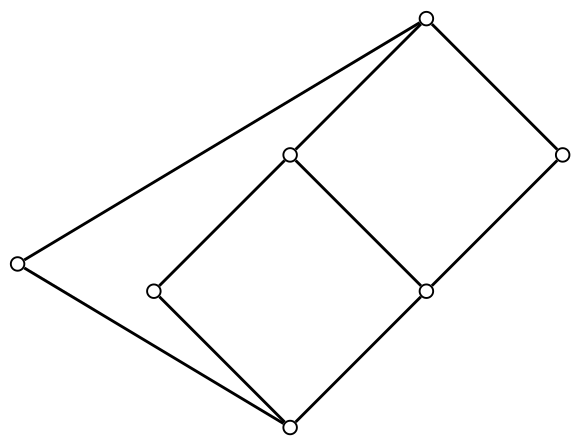

# Current Status & The Hunt for a Counterexample

As of today, the FLRP remains **unsolved**.  It stands as one of the most
significant open problems in universal algebra.

### The Prevailing Conjecture

The general consensus among experts is that the answer to the FLRP is **no**:
there exists at least one finite lattice that cannot be represented as the
congruence lattice of any finite algebra.  This belief is fueled by the
decades-long failure to find a general proof and by the difficulty of
constructing representations for even moderately complex lattices.

### Major Obstacles

+  **Finiteness is tricky.**  We lack a deep understanding of how the constraint
   of a finite universe restricts the structure of a congruence lattice.
+  **Constructions are hard.**  Methods for building algebras with a prescribed
   congruence lattice often produce infinite algebras.
+  **Group theory is hard.**  The Pálfy–Pudlák equivalence translates the FLRP
   into an equally challenging problem about intervals in subgroup lattices of
   finite groups.

### The Seven-Element Frontier Is Closed

For fourteen years the search for a counterexample focused on a single
seven-element lattice.

!!! success "The L7 lattice, representable since 2026"

    Every lattice with at most seven elements was known to be representable
    except one, the seven-element lattice **L7** identified in William DeMeo's
    2012 thesis.

    {width=300 height=200}

    +  In 2026, Chenxiao Tian showed that L7 is an interval in the subgroup
       lattice of $\mathrm{PSL}(2, 64)$, and a scan of the tables of marks
       found a second representation, in $\mathrm{Sp}(6, 2)$ at a smaller
       index.  Both are verified in GAP, and the write-up is in
       preparation.
    +  Every lattice with at most seven elements is therefore representable.
    +  The census frontier is now the 222 lattices with eight elements, and
       the smallest height-two lattice with no known representation is
       $M_{16}$.

### Where the Search Stands Now

The search is no longer aimed at a single candidate lattice.  The strategy
described under *Current & Future Research* looks instead for a finite family
of group-theoretic properties, each forced by some lattice shape, that no
finite group can have simultaneously; by a theorem proved in
[Interval enforceable properties of finite groups](https://arxiv.org/abs/1205.1927),
such a family would settle the problem negatively without naming a
counterexample in advance.  The smallest lattices that strategy would have
used, the hexagon and its seven-element relatives, are now known to be
representable in almost simple groups, so any contradiction must come from
larger shapes or finer invariants.  See [the plan](deep.md).
